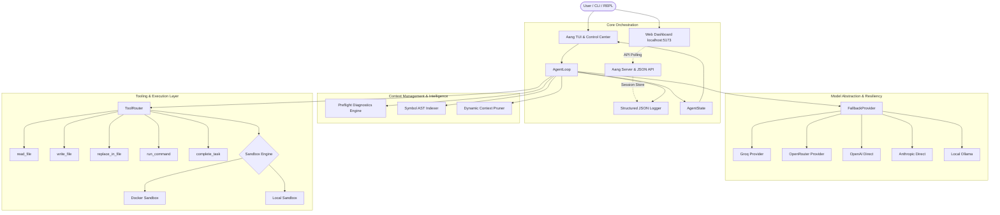

# ⚡ Aang — Autonomous Terminal Coding Agent & SWE-Bench Harness
> *High-efficiency coding agent with multi-key rotation and zero-turn context injection. Run via `npx aang-ai` or `pip install aang-ai`.*

**Aang** is a high-performance, terminal-first autonomous software engineering agent and benchmark harness. Built for developer transparency and raw execution speed, Aang investigates codebases, diagnoses test failures, executes surgical multi-file edits, and verifies its work in sandboxed environments—all while streaming its reasoning in a rich terminal interface with its animated pixel mascot and a live web dashboard.

---

## 🏛️ System Architecture

Aang is architected as a modular, provider-agnostic system decoupling planning, context management, tool dispatch, and runtime sandboxing:



---

## 🧠 Deep Dive: Context Management System

Context degradation, token bloat, and hallucinated paths are the primary failure modes of autonomous coding agents. Aang implements a 4-tier context engineering pipeline that keeps token consumption minimal while ensuring the model acts with maximum precision from **Iteration 1**:

### 1. Preflight Diagnostics & Zero-Turn Context Injection
Before the agent loop makes its first LLM call, Aang runs preflight diagnostics:
- **Test Command Auto-Detection**: Regex-parses the task prompt or inspects `package.json` / `pytest` configs to discover the target test command (`npm test`, `pytest`, `node <test>.js`).
- **Pre-execution Failure Capture**: Runs the test command inside the sandbox to capture initial exit codes, stdout, and stack traces.
- **Immediate Implicated File Extraction**: Extracts erroring source files directly from the stack trace and feeds the failure output into the initial prompt. The LLM does not need to waste 1–2 iterations running tests or searching for where errors originate.

### 2. Symbol AST Indexing & Priority Ranking
Aang features a built-in symbol indexer ([`aang/agent/indexer.py`](aang/agent/indexer.py)) that scans Python and JavaScript/TypeScript files:
- **Symbol Extraction**: Extracts classes, functions, and exports without heavyweight external language servers.
- **Task Query Matching**: Matches words from the user task against indexed symbols and tests imports.
- **Priority Scoring**:
  $$\text{Score} = 100 \times \mathbb{I}_{\text{explicit mention}} + 35 \times \mathbb{I}_{\text{symbol match}} + 25 \times \mathbb{I}_{\text{test import}} + 15 \times \mathbb{I}_{\text{token match}}$$
- **Focal File Injection**: Injects up to 6 high-priority files (within a 1500-line budget) directly into the preflight prompt, giving the model full visibility of critical code upfront.

### 3. Dynamic Context Pruner (`_prune_context`)
Over long-running tasks (10–15 iterations), repeating large file contents and historical test outputs causes exponential token growth and hits API provider rate limits.
- **Protected Boundaries**: Preserves the immutable System Prompt (`messages[0]`), the original enhanced user task (`messages[1]`), and the most recent 6 conversational turns.
- **Stale Tool Truncation**: Automatically trims intermediate tool outputs (e.g. historical multi-hundred-line file reads or previous failed test runs) down to concise snippets (`... [Previous tool output truncated for token efficiency] ...`).
- **Token Reduction**: Cuts message history tokens by **60–75%**, allowing models like `gpt-oss-120b` and `gpt-oss-20b` to operate comfortably within tight TPM ceilings.

### 4. Self-Healing Tool Feedback
When an LLM attempts an edit that fails (e.g. whitespace mismatch in `replace_in_file` or argument format discrepancies):
- Aang does not return a generic failure. It returns an **Actionable Self-Healing Hint** containing the current lines from disk and instructions on how to use `read_file` or `write_file` to recover cleanly.
- `read_file` and `write_file` support tolerant keyword aliases (`line_start`, `line_end`, `contents`, `text`, `code`), preventing models from stalling on tool schema mismatches.

---

## 🔄 Provider Abstraction & The Fallback Engine

Aang guarantees task completion even when third-party AI APIs suffer from outages, credit limits, or transient rate limits:

```
[Primary Model: Groq openai/gpt-oss-120b]
                   │
                   ▼ (429 Rate Limit / 404 Model / 402 Credits)
       [Fallback 1: Groq openai/gpt-oss-20b]
                   │
                   ▼ (Rate Limit Exceeded)
       [Fallback 2: Groq qwen/qwen3.8-27b]
                   │
                   ▼ (Provider Failure)
       [Fallback 3: OpenRouter / OpenAI Direct]
```

- **`FallbackProvider`**: Wraps any primary provider with an ordered chain of backups. When a call fails due to `402 Payment Required`, `404 Model Not Found`, or repeated `429 Rate Limits`, the engine gracefully logs the transition and retries seamlessly with the next model.
- **Exponential Backoff**: Inspects `Retry-After` headers and error strings (e.g., `try again in 5.3s`) to perform exact countdown pauses before resuming execution.
- **Multi-Key Rotation**: Supports comma-delimited `GROQ_API_KEYS` pools, rotating seamlessly across keys on rate limits.

---

## 🛠️ Sandbox Environments

All code edits and command executions run through an isolated sandbox interface:

| Sandbox Mode | Description | Isolation Level | Best For |
| :--- | :--- | :--- | :--- |
| **`DockerSandbox`** | Spawns an isolated container mounting the repo. Non-root user permissions, strict command timeouts, and resource limits. | 🟢 Full Isolation | Untrusted code, production benchmark runs |
| **`LocalSandbox`** | Runs directly on the host workspace with sub-millisecond execution times. | 🟡 Workspace Bound | Fast local iteration, simple scripts |

---

## 🖥️ User Interfaces

### 1. Terminal TUI & Interactive REPL
Launch the full interactive TUI using:
```bash
# Zero-install via npx:
npx aang-ai

# Or with local installation:
aang --repo .
```

- **Live Activity Grid**: Shows current model, elapsed execution time, iteration count, and live reasoning thoughts.
- **Unified Diff Viewer**: Type `/diff` to inspect colored syntax-highlighted git diffs of uncommitted changes.
- **Session Logs**: Type `/log [lines]` to print the recent execution trace in the terminal.
- **State Rollback**: Type `/rollback` to instantly reset the working tree to a clean git state.
- **Dynamic Model Switching**: Type `/model` to view all configured providers and switch models on the fly.

### 2. Web Dashboard & Live Monitor
Aang includes an integrated web dashboard running as a background daemon:
```bash
make web
# Starts dashboard at http://localhost:5173/
```
- **Timeline & Session History**: Step-by-step tree of all previous runs with duration and tool calls.
- **Colorized Diff Viewer**: Side-by-side view of all files modified by the agent.
- **Live Logs**: Real-time terminal output and structured JSON logs.
- **Interactive Benchmark Trigger**: Run automated synthetic verification scenarios directly from the UI header.

---

## 🚀 Quickstart & Onboarding

### Option 1: Run via npx (Zero Install)
Requires Node.js 16+ and Python 3.11+.
```bash
npx aang-ai
```
> *On your first run, Aang automatically launches an interactive setup wizard to help you connect your preferred AI provider (Groq, OpenRouter, OpenAI, Anthropic, or Local Ollama) in under 30 seconds.*

### Option 2: Install Globally via npm
```bash
npm install -g aang-ai
aang setup       # Configure API keys globally
aang             # Start coding
```

### Option 3: Install via pip
```bash
pip install -e .
aang setup
aang
```

### Option 4: From Source
```bash
git clone https://github.com/frenemy17/aang.git
cd aang
make install
make setup       # Interactive onboarding wizard
make aang        # Start interactive session
```

---

## ⚡ Built-in Commands & CLI Shortcuts

| Command | Description | Example |
| :--- | :--- | :--- |
| **`aang`** | Starts interactive TUI session in current directory | `aang` |
| **`aang "task"`** | Runs a coding task directly in current workspace | `aang "Fix failing tests in user.py"` |
| **`aang setup`** | Interactive wizard to configure or update API keys | `aang setup` |
| **`aang doctor`** | Health check: Python, Git, Docker, and API connectivity | `aang doctor` |
| **`aang web`** | Starts live web monitor and session inspector | `aang web` (http://localhost:5173) |
| **`aang --repo <path>`** | Target a specific repository or workspace folder | `aang --repo ~/Desktop/my-project` |

---

## ⚙️ Configuration & Environment Keys

Keys can be configured interactively using `aang setup` (saved to `~/.aang/.env` for all projects), or exported directly in your shell or `.env`:

```bash
# Provider Selection (Default: groq)
export AANG_PROVIDER=groq
export AANG_MODEL=openai/gpt-oss-120b

# Groq (Recommended: Ultra-fast reasoning & free tier at console.groq.com)
export GROQ_API_KEY="gsk_..."
export GROQ_API_KEYS="gsk_key1,gsk_key2,gsk_key3"

# OpenRouter (Optional: Access to 200+ models)
export OPENROUTER_API_KEY="sk-or-v1-..."

# OpenAI Direct (Optional)
export OPENAI_API_KEY="sk-proj-..."

# Anthropic Direct (Optional)
export ANTHROPIC_API_KEY="sk-ant-..."
```

---

## 🎯 Usage Examples

### Interactive Session with Mascot & Diff Inspector
```bash
aang
```
Inside the interactive session, use slash commands:
- `/help` — View commands cheatsheet
- `/setup` — Reconfigure providers or API keys
- `/model` — Switch AI models on the fly
- `/diff` — View git diff of changes made by Aang
- `/rollback` — Undo recent changes
- `/exit` — Quit

### Automated / Headless Execution
```bash
aang "Fix the failing tests in test_payment.py and handle edge cases"
```

### Specifying Models and Log Output
```bash
aang --provider groq --model openai/gpt-oss-120b --log ./my-run.log "Refactor authentication module"
```

---

## 📄 License
MIT License. Built with ❤️ for autonomous software engineering.
